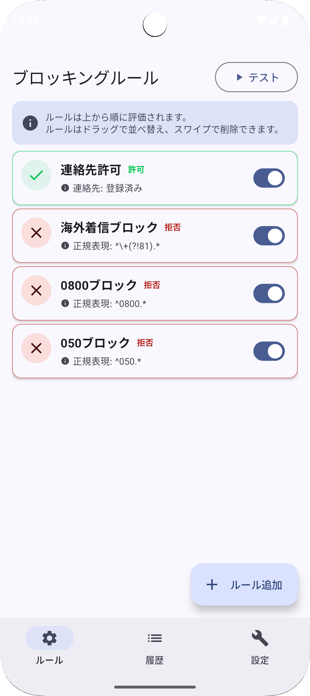
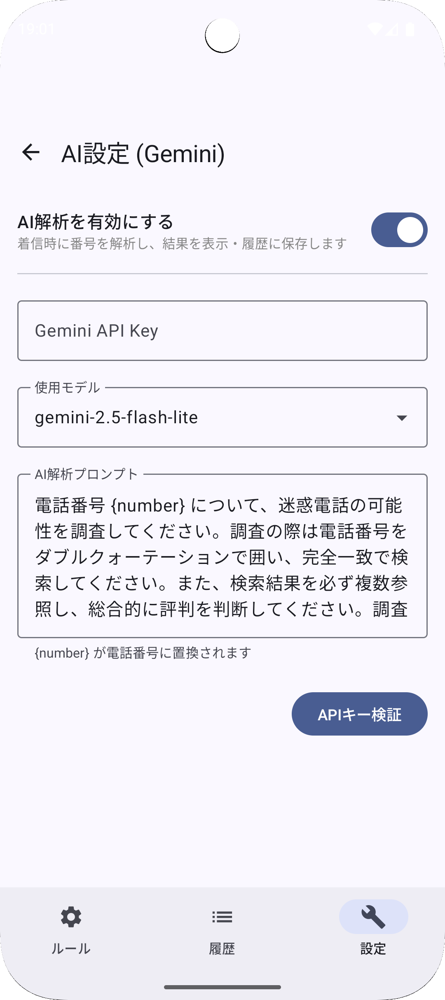
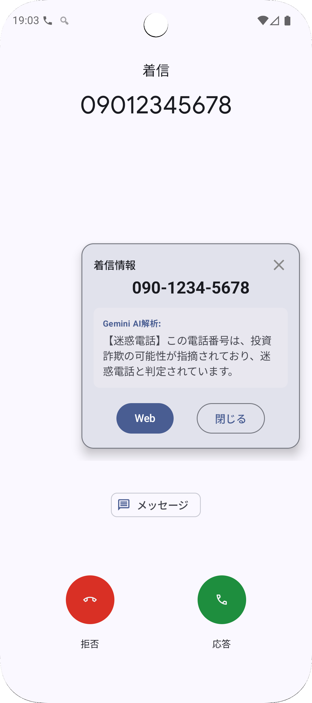
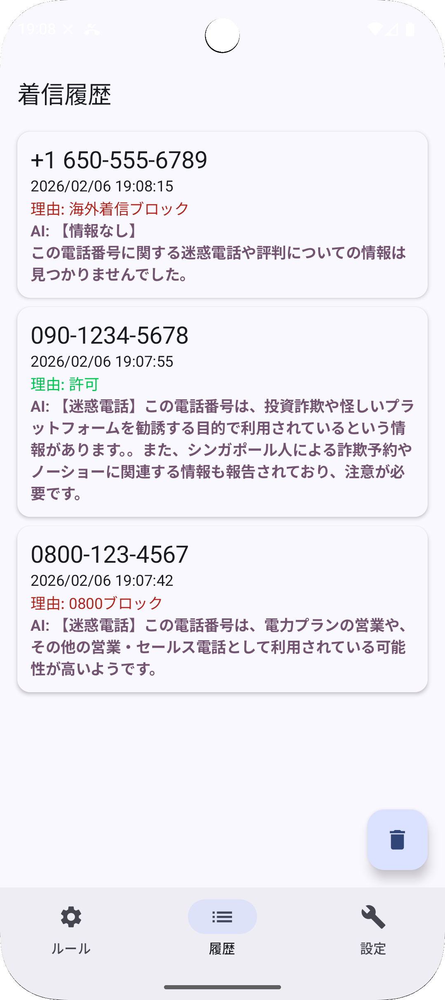

# 🛡️ CallBlocker

CallBlocker は、Android OS の Call Screening API を利用した強力な着信ブロック・迷惑電話対策アプリケーションです。

## スクリーンショット
| ルール一覧 | ルール編集 | AI設定 |
|:---:|:---:|:---:|
|  |  |  |

| 着信時オーバーレイ | 着信履歴 |
|:---:|:---:|
|  |  |

## 主な機能

### 1. 高度な着信ブロック
- **柔軟なルール設定**: 正規表現、連絡先の登録有無、日時・曜日を組み合わせた複雑なブロック条件を作成可能。
- **ホワイトリスト対応**: 拒否だけでなく「特定の番号のみ許可」する設定も容易です。
- **シミュレーション機能**: 作成したルールが正しく動作するか、アプリ内で即座にテストできます。

### 2. AI (Gemini) による着信番号解析
- **リアルタイム解析**: 着信時に AI（Google Gemini）が電話番号をインターネットから解析し、スパムの可能性や発信元を判定します。
- **履歴からの再解析**: 過去の着信についても、いつでも詳細な情報を確認できます。
- **カスタマイズ**: 自分の Google Gemini API キーを使用して、推論モデルや解析プロンプトを自由に調整可能です。

### 3. スマートなユーザー体験
- **フローティング・オーバーレイ**: 着信中に情報のサマリーを画面上に表示。ドラッグによる位置保存や、通話終了時の自動消去に対応しています。
- **履歴管理 & Web検索**: ブロックした着信をリスト化。ワンタップで Google 検索などの Web 検索へ連携できます。
- **マテリアルデザイン 3**: Android 12 以降のダイナミックカラーやダークモードに完全対応した、直感的で美しい UI。

### 4. 安全なデータ管理
- **バックアップ・復元**: 全ての設定やルール、履歴を JSON 形式でエクスポート・インポート可能です。
- **プライバシー重視**: 全ての処理はデバイス上（および Gemini API との直接通信）で行われ、開発者を含む第三者のサーバーへ履歴が送信されることはありません。

## 技術スタック
- **Language**: Kotlin
- **UI**: Jetpack Compose (Material 3)

## ビルド・インストール
1. リポジトリをクローンまたはダウンロードします。
2. Android Studio (Latest stable) でプロジェクトを開きます。
3. リリースビルドを行うと、`outputs/apk/release/` に `callblocker-release-v1.0.apk` 形式でファイルが生成されます。

## 注意事項
- このアプリは「着信ブロックロール（Call Screening Service）」を利用します。アプリ内の案内に従って、システム設定で本アプリをデフォルトの着信ブロックアプリとして許可してください。
- AI 解析機能を利用するには、別途 [Google AI Studio](https://aistudio.google.com/) で取得した API キーが必要です。

